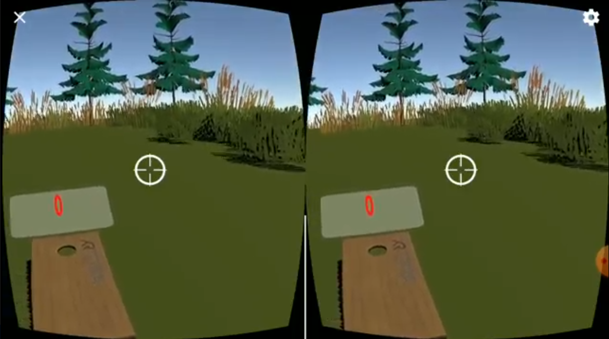

# VR Beanbag Toss
 
A virtual reality project created as part of [XRTerra's AR & VR Developer Program](https://xrterra.com/programs/developer/).

## Decription

This application is a virtual reality rendition of the popular cornhole/beanbag toss game, for Android phones with Google Cardboard compatibility (essentially all phones running Android 4.1 or higher, and which have a gyroscope). The virtual reality scene consists of a natural environment, with a cornhole board placed on some distance from the player, an interactables table where each new beanbag is spawned, and where the user can switch between environments. A score field above the board is updated after every valid throw, with +1 points for every throw on the board, and +3 for every throw into the hole. The beanbag can be thrown wherever by grabbing it, aiming it at a specific location, and letting go of the controller.

## Installation

An .apk file can be found in the Builds folder.

## Built With

* [Unity](https://unity.com/)
  * Version: 2019.4.2f1
* [Microsoft Visual Studio Code](https://code.visualstudio.com/)
  * Version: 2019
  
## Development Setup

The system requirements can be found [here](https://docs.unity3d.com/Manual/system-requirements.html).

## Contact
 
Daniel Sharvaaya Dash - daniel.s.dash@gmail.com
 
Project Link: https://github.com/drash7/VR-Beanbag-Toss
 
## Contributing
 
I greatly appreciate any contribitions.
1. Fork the Project
2. Create your Feature Branch (`git checkout -b feature/CoolFeature`)
3. Commit your Changes (`git commit -m 'Add some CoolFeature'`)
4. Push to the Branch (`git push origin feature/CoolFeature`)
5. Open a Pull Request
